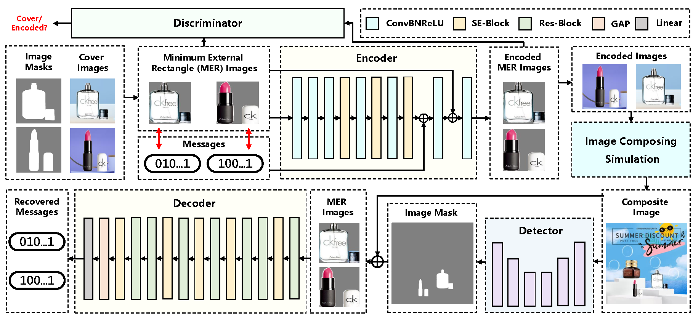

# MuST: Robust Image Watermarking for Multi-source Tracing

It's the official implementation of AAAI-2024 paper _"MuST: Robust Image Watermarking for Multi-Source Tracing"_ 

by _Guanjie Wang, Zehua Ma, Chang Liu, Xi Yang, Han Fang, Weiming Zhang, Nenghai Yu_



The google drive link of our SOIM dataset is [https://drive.google.com/file/d/1enOkjrVBJRUJesLERZ3obYe7hlZpLWSb/view?usp=sharing]

## Citation
If you find this work useful, please consider citing our paper:
```
@inproceedings{must-aaai2024,
  title = {MuST: Robust Image Watermarking for Multi-source Tracing},
  author = {Wang, Guanjie and Ma, Zehua and Liu, Chang and Yang, Xi and Fang, Han and Zhang, Weiming and Yu, Nenghai},
  booktitle = {Association for the Advancement of Artificial Intelligence},
  year = {2024},
}
```